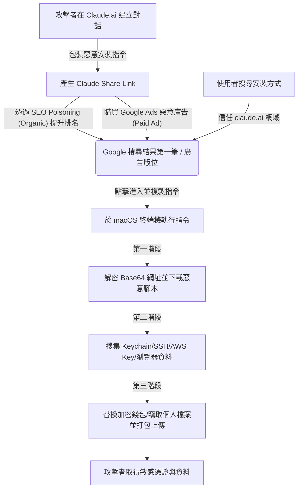

# 7/10 macOS Claude Code 惡意 SEO 詐騙案例分析報告

## 原始貼文資訊
- **發文者**：[Jason Cheng](https://www.facebook.com/jason.cheng.9615)
- **發文時間**：2026 年 7 月 10 日 22:56
- **原始貼文連結**：[Facebook Post](https://www.facebook.com/jason.cheng.9615/posts/pfbid0h4vByKUd3eKqqtcZK9wi9EcgH87eGocsUaN2fZ6xsUcZHzFnZcRGp4mbpXP5jBCJl)

---

## 1. 貼文本文

> [!IMPORTANT]
> **[7/10 資安案例分享，使用 mac 及 claude code 朋友請留意]**

最近新購的 MacBook Air M5 剛到貨 (7/9)，正在把需要的軟體裝的差不多了，剩下 Claude Code 還沒裝。

結果事情大條。

---
7/10 上午我先去 google 搜尋最新版 claude code 安裝指令，第一個結果看起來是 `claude.ai` 的 domain 沒錯（圖一），進去也有一行指令（圖二），忙碌中一時不察就在新機執行.... 忽然感到不太對勁，瞄一眼網址怎麼是 base64 的，然後開始跳 macos 的 keychain 一直問我密碼！

馬上警覺，立刻中止、關閉 WIFI、關機、進入 Recovery 完整抹除磁碟。至此，忽然覺得這兩天新機做環境都做白工了 = =

---
從貼上指令執行到斷網與關機，總共過去約 40 秒。

採用處理過的 claude chat 內容 share 出來這招，果然高。

冷靜想了一下，以原本的平常用工作機回頭分析可能有那些問題：

* **#一**：將該指令的 base64 解碼後網址送去 VirusTotal 檢測，尚未被發現出問題（圖三）。
* **#二**：打開 Claude Code 請它以該指令模擬整個執行後以及又下載那些 payload 進行，結果分析快完成時 Claude 就因為資安政策打斷了。
* **#三**：改用 Codex 接續分析。
* **#四**：同時，用 Claude Desktop 接取我 `mcp_graylog`，從 log 中分析 opnsesne、zenarmor、adguard、等等記錄，確認下載兩次 payload 並上傳一次資料出去。
* **#五**：接著搭配 `mcp_pve`、`mcp_wazuh`、`mcp_zimbra` 等等我寫的多個週邊系統 mcp 工具檢測，確認尚未發起橫向移動行為。
* **#六**：該主機還沒安裝 Wazuh Agent，所以沒來得及記錄到本機行為。
* **#七**：Codex 分析完成，確認分三個階段：執行 script、下載其它 script 執行並上傳搜集資料、下載另一支惡意程式並取得重點應用程式資料（其中包括 Ledger/Trezor 這兩個加密貨幣相關軟體甚至會替換成加料版）。
* **#八**：它會嘗試偷本機密碼、Keychain 內所存的帳號密碼、主流瀏覽器帳號密碼記憶庫/Cookie/IndexedDB..等、一堆系統維運與開發相關的配置檔（`~/` 裡面的 `.ssh`、`.aws`、`.kube`、`.zshrc`、`.zsh_history`、`.gitconfig` 等一堆）、Telegram 資料、`Desktop`/`Downloads`/`Documents` 資料夾內多種副檔名檔案（`.pdf`/`.docx`/`.key`/`.ovpn`/`.db`/`.txt`/`.kdbx` 等）。

---
新機剛開始初始化配置無太多資料，且我儘量不用 macos 的 keychain 與瀏覽器記憶密碼，所以第一次那包出去的資料中應無重要系統資料，但為了保險起見，我仍然立刻檢視所有帳號隨即變更密碼、檢查登入裝置、確認 2FA。

---
* **註一**：Codex 可以完整跑完所有分析，Claude 稍微看到可疑的東西就罷工不幹了....幹。（圖四）
* **註二**：我剛剛看 (7/11) 這個搜尋結果依然還掛在第一筆。（圖五）
* **註三**：在我的測試機驗證，Avast Free for Mac 版本已經可以攔下第一步、第二步的惡意 script 下載。

---

## 2. 貼文附圖

我們已經將貼文中的高解析度圖片下載至當前目錄的 [FB文章_images/](file:///Users/lanss/projects/2_Practice/1150711_test2/FB文章_images) 資料夾下：

| 圖片名稱 | 圖片預覽與說明 |
| :--- | :--- |
| **發文者頭像** |  發文者 Jason Cheng 的 Facebook 頭像 |
| **圖一：搜尋結果** |  Google 搜尋結果第一筆（點進去網址是官方 domain `claude.ai`） |
| **圖二：安裝對話** |  偽裝成 Claude Code Mac 安裝步驟的 Share Link 對話頁面 |
| **圖三：偵測結果** |  安全防護軟體檢測或分析結果 |
| **圖四：分析報表** |  對惡意 URL 的 VirusTotal 檢測或 Codex 分析報告畫面 |
| **圖五：仍掛在首位** |  7/11 搜尋時該偽造頁面依舊排在 Google 第一筆 |

---

## 3. 社群留言與討論整理

以下是該貼文下方精選的網友技術討論與交流：

* **潘子澄**：google 搜尋結果第一筆都要看的很小。
* **Brune Kz**：要用 duckduckgo lite, brave, kagi search 一律不可以。要看它的 url 是不是有再包一層，再搭配 uBlock origin + Firefox。（已編輯）
* **網友 A**：wow，這個有聰明，直接把對話 sharelink 去買廣告（或是做 SEO），這樣 domain 就不是假的。
* **網友 B**：哇！這高招。不過我剛測試都回覆使用 `npm install`，沒看到 `curl`。
* **黃振慶**：請問可以分享嗎？
  * **Jason Cheng**：已回覆。（已授權分享）
* **潘柏綸**：他要被關起來解剖研究了……（遞手術刀）
* **Alex Lau**：我為什麼要搞自己的 MoJoAssistant 就是預防這些問題，以後只會越來越隱蔽。
  * **網友 C**：你也中了……我是中 codex。

---

## 4. 攻擊手法深入剖析 (Security Analysis)

### 攻擊流程圖 (Attack Flowchart)

> 💡 **資安小學堂：SEO 投毒（Organic） vs. 惡意廣告（Malvertising）**
> 很多網友留言提到「買廣告或做 SEO」，這兩者在技術上有精準的區分：
> - **SEO 投毒 (SEO Poisoning)**：操縱搜尋引擎演算法，提升惡意網頁在自然搜尋結果的排名（例如經典的 **Gootloader** 攻擊，入侵合法 WordPress 網站塞入法律範本，誘騙搜尋者下載惡意 JS 腳本）。
> - **惡意廣告 (Malvertising)**：直接付費購買 Google Ads 廣告版位，將偽冒網站置頂（例如經典的 **KeePass / Rufus 偽冒廣告**，用 Cloaking 偽裝技術規避審查，將點擊廣告的使用者導向 1:1 克隆的惡意官網下載竊密軟體）。
> 本案中攻擊者極可能是雙管齊下，利用了這兩種管道來接觸受害者。

### 關鍵安全防禦指南
1. **檢查指令中的混淆代碼**：在使用任何 `curl | sh` 的指令前，務必將其中的 `base64 -d` 或其他混淆內容解碼審查。
2. **認明官方安裝管道**：Claude Code 官方目前應使用 `npm install -g @anthropic-ai/claude-code` 來安裝，官方文檔網址為 `docs.anthropic.com`。切勿輕信 `claude.ai/share` 產生的對話分享網址作為安裝來源。
3. **使用沙盒或測試機**：在未確認指令安全前，應避免在存放重要憑證（如 SSH key, AWS key, Kubeconfig 等）的開發工作機上直接執行未經審查的網路指令。